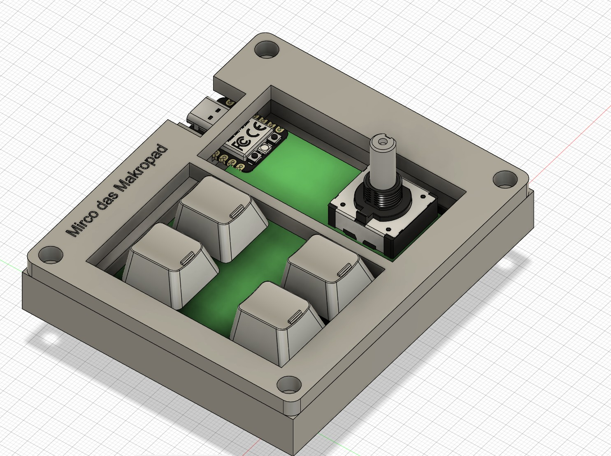
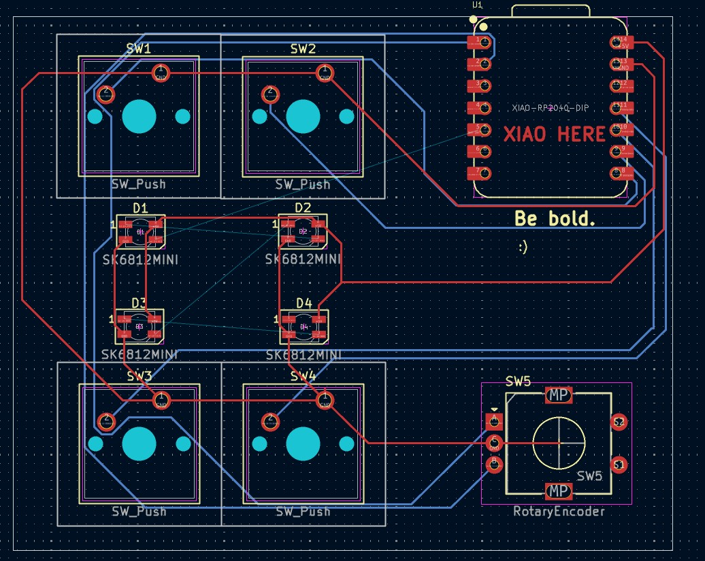
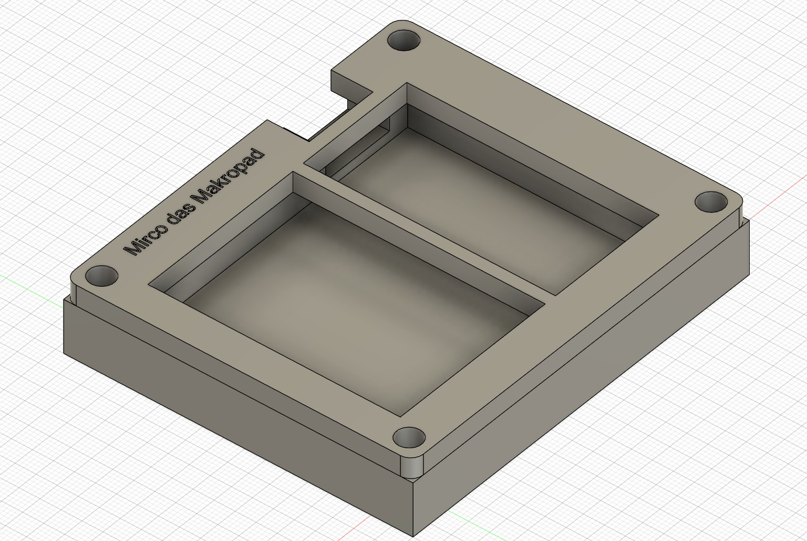
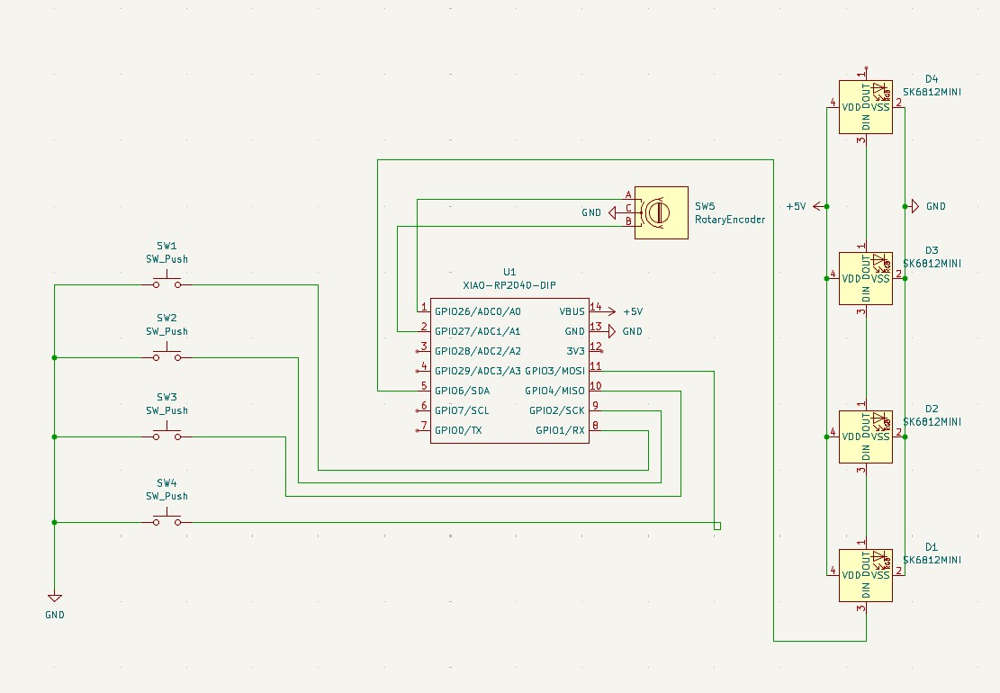

My Hackpad
-Hi, here is my hackpad!
-
-
-BOM:
-- 4x Cherry MX Switches
-- 2x SK6812 MINI Leds
-- 1x XIAO RP2040
-- 4x Blank DSA Keycaps
-- 4x M3x16 Bolt
-- 4x M3 Heatset
-- 1x EC11 Rotary Encoder
-

+
# Hackpad

Welcome to my Hackpad project!

---

## Bill of Materials (BOM)

| Qty | Part                   |
|-----|------------------------|
|  4  | Cherry MX Switches     |
|  2  | SK6812 MINI LEDs       |
|  1  | XIAO RP2040            |
|  4  | Blank DSA Keycaps      |
|  4  | M3x16 Bolt             |
|  4  | M3 Heatset             |
|  1  | EC11 Rotary Encoder    |

---

## Images

### Assembly

### PCB

### Case

### Schematic

---